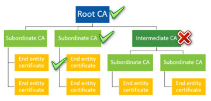
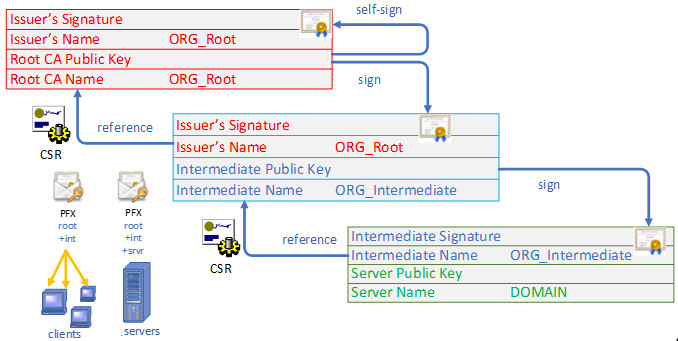
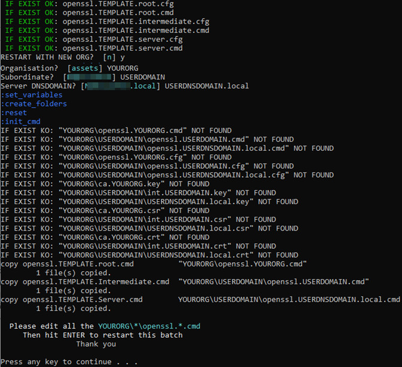
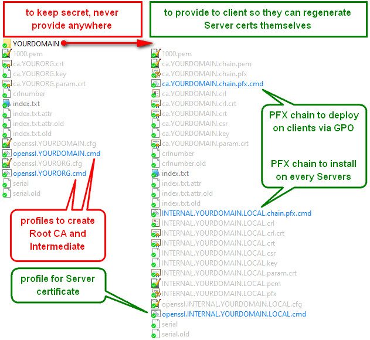

# certificator

- generate CA + Subordinate + Server certificates chain using wildcard.USERDNSDOMAIN
- outputs server PFX and clients PFX + unattended batch install with password inside
- generates CRL structure to renew Sub and Server certs later on



## How To
1. run certificator.cmd and answer the questions
2. edit all 3 batches generated under YOURORG folder and YOURORG/USERDOMAIN subfolder
3. run certificator.cmd again (Optional: run as admin to be able to import the generated PFX)
4. optional: import the generated PFX by runing the generated batches *.chain.pfx.cmd


PFX installers:
- DNSDOMAIN/ca.DOMAIN.chain.pfx.cmd = Root+Subordinate chain to deploy on every desktop
- DNSDOMAIN/DNSDOMAIN.chain.pfx.cmd = Root+Subordinate+Server chain to deploy on servers ONLY


## Requisites
- powershell
- **openssl** for Winmdows (provided in /bin - get it [here](https://slproweb.com/products/Win32OpenSSL.html))
  - works with OpenSSL 1.1.1x and 3.x

## Edit custom files in Details
### openssl.TEMPLATE.root.cmd
RSA vs ECC is still subject of debate as of 2021. There is no denial that it's faster and exponentially more secure than rsa. However some ill-developped clients still cannot handle it.
```
set ENCRYPTION=RSA

:: this is your Root CA ORGanisation short name
set ORG_Root=YOURORG
:: this is your Intermediate ORGanisation short name and could be = to %USERDOMAIN%
set ORG_Intermediate=USERDOMAIN
```

109500 = 30 years
```
set default_days_Root=109500
```

From a security perspective, sha512 is overkill: In practical terms, SHA-256 is just as secure as SHA-384 or SHA-512. We can't produce collisions in any of them with current or foreseeable technology, so the security you get is identical. 

Reasons to choose SHA-256 over the longer digests: smaller packets, requiring less bandwidth, less memory and less processing power. Also there are likely compatibility issues, since virtually no one uses certs with SHA-384 or SHA-512, you're far more likely to run into systems that don't understand them. MFD/MFP/Photocopiers of any brand come to mind. Most still rely on SHA1 by default.

```
REM set default_md_Root=sha512
set default_md_Root=sha256
```

"Experts" constantly predict the end of 1024bit encryption but, as of 2022 the 256bit still has not been breached, let alone 512 or 1024. Using 2048 bits over 1024, your security is improved 2^1024 times. 4096 should only be used for the Root CA if at all.
* [Comparison of bit size vs effectiveness for RSA vs ECC](https://sectigo.com/resource-library/rsa-vs-dsa-vs-ecc-encryption)

| RSA | ECC |
| --- | --- |
| 1024 | 160 |
| 2048 | 224 |
| 3072 | 256 |
| 7680 | 384 |
```
set default_bits_Root=4096
```


* [is-curve-p-384-equal-to-secp384r1?](https://crypto.stackexchange.com/questions/70889/is-curve-p-384-equal-to-secp384r1?newreg=a86ae3c6cbfd427e94e0a8682450c2cf) In practice, average clients only support two curves, the ones which are designated in so-called NSA Suite B: 
  * these are NIST curves P-256 and P-384 (in OpenSSL, they are designated as, respectively, "prime256v1" and "secp384r1"). 
  * If you use any other curve, then some widespread Web browsers (e.g. Internet Explorer, Firefox...) will be unable to talk to your server.
  * FYI www.google.com uses secp384r1; if your browser cannot access google, consider upgrading.
* secp384r1 (ASN1 OID) == P-384 (NIST CURVE) = NIST/SECG curve over a 384 bit prime field
  * [NIST-P](https://nvlpubs.nist.gov/nistpubs/FIPS/NIST.FIPS.186-4.pdf)
  * [SECG](https://www.secg.org/sec2-v2.pdf)
* prime256v1                               = X9.62/SECG curve over a 256 bit prime field
* Contender, without participation of the NSA: Curve25519 - UMAC is much faster than HMAC for message authentication in TLS. see [RFC 4418](http://www.ietf.org/rfc/rfc4418.txt) or [that one](http://fastcrypto.org/umac/)
```
set default_ecc_Root=secp384r1
```

Password for Private keys and certificates, can be blank but should be 20 chars really:
```
set PASSWORD_Root=root_key_pass
```

Now for the Organization names, address etc:
```
::::::::::::::::::::::::::::::::::::::::::::::::::::::::::::::::::::::::::::::::::::::::::::
:: req_distinguished_name section, https://en.wikipedia.org/wiki/Certificate_signing_request
:: Only countryName MUST be 2 chars, the rest can be 64 chars max
:: few CA Root have a country name
REM set countryName_Root=US
set organizationName_Root=CA
:: Subject Organization Name Field: subject:organizationName (OID 2.5.4.10 )
set organizationalUnitName_Root=YOURORG
:: Subject Common Name Field: subject:commonName (OID:  2.5.4.3)
:: Required/Optional:   Deprecated (Discouraged, but not prohibited)
set commonName_Root=CA YOURORG Root
::::::::::::::::::::::::::::::::::::::::::::::::::::::::::::::::::::::::::::::::::::::::::::
```

Intermediate policies: OIDs of public policies that apply to your Intermediate CA 

To respect the CA Browser EV Guidelines, you must be registered in IANA under [1.3.6.1.4.1](https://www.alvestrand.no/objectid/1.3.6.1.4.1.html)

* Example: Internet Private: 1.3.6.1.4.1.44947.1.1.1 = OID attached to certificates issued by Let's Encrypt.
* Example: some are reserved such as 2.16.840.1.101 = gov; 2.16.840.1.113938 = EQUIFAX INC.; etc.
* Object Identifiers (OID) are controlled by IANA and you need to register a Private Enterprise Number (PEN), or OID arc under 1.3.6.1.4.1 namespace.
* Here is the [FREE PEN registration page](http://pen.iana.org/pen/PenApplication.page)

Your private namespace OID should be present in the Root CA and Intermediate CA
1. Statement Identifier:  1.3.6.1.4.1.311.42.1 = Microsoft; use yours or 1.3.6.1.4.1 for LAN / internal domains.
2. Certificate Type:      Domain Validation:          2.23.140.1.2.1 = [domain-validated](https://oidref.com/2.23.140.1.2.1)
3. Certificate Type:      Organization Validation:    2.23.140.1.2.2 = [subject-identity-validated](https://oidref.com/2.23.140.1.2.2)

```
set policiesOIDs_Intermediate=1.3.6.1.4.1, 2.23.140.1.2.1, 2.23.140.1.2.2,
```

End points policies: OIDs of public policies that apply to your end point / server CA 
1. Statement Identifier:  1.3.6.1.4.1.311.42.1 = Microsoft; use yours or 1.3.6.1.4.1 for LAN / internal domains
2. Certificate Type:      Organization Validation:    2.23.140.1.2.2 = [subject-identity-validated](https://oidref.com/2.23.140.1.2.2)
```
set policiesOIDs_Server=1.3.6.1.4.1, 2.23.140.1.2.2,
```

3. Practices Statement:   id-qt-cps: OID for CPS qualifier    [1.3.6.1.5.5.7.2.1](https://www.alvestrand.no/objectid/1.3.6.1.5.5.7.2.1.html)
* [how-do-i-create-my-own-extended-validation-certificate-to-display-a-green-bar](https://stackoverflow.com/questions/51641962/how-do-i-create-my-own-extended-validation-certificate-to-display-a-green-bar/51644728)
* [certificate-policies-extension-all-you-should-know-part-1](https://www.sysadmins.lv/blog-en/certificate-policies-extension-all-you-should-know-part-1.aspx)

```
::    1.3.6.1.5.5.7.2 - id-qt policy qualifier types RFC2459
::    1.3.6.1.5.5.7 - PKIX
::    1.3.6.1.5.5 - Mechanisms
::    1.3.6.1.5 - IANA Security-related objects
::    1.3.6.1 - OID assignments from 1.3.6.1 - Internet
::    1.3.6 - US Department of Defense
::    1.3 - ISO Identified Organization
::    1 - ISO assigned OIDs 
set policyIdentifier=1.3.6.1.5.5.7.2.1
```

CPS Point to the Internet Security Research Group (ISRG) Certification Practice Statementer of the CA emiter. That describes the policy under which the certificate in the subject was issued.

Examples:
* http://cps.letsencrypt.org
* http://certificates.godaddy.com/repository/
* https://www.digicert.com/legal-repository
```
set CPS.1=http://server1.yourcompany.com/ssl/cps/
```

User Notice is a small piece of text (RFC recommends to use no more than 200 characters) that describes particular policy.
```
set explicitText=This certificate protects the private data transmitted throught the local domain USERDOMAIN, own by yourCompany Inc.
set organization=yourCompany Inc.
```

X509v3 CRL Distribution Points aka revocation url. You should serve `int.%ORG_Intermediate%.crl` (DER) and `int.%ORG_Intermediate%.crl.crt` (PEM) over http at this address:
```
set crlDistributionPoints.1=http://server1.yourcompany.com/int.%ORG_Intermediate%.crl
```


### openssl.TEMPLATE.intermediate.cmd
Edit the file similarly to thre root CA batch. This is a Subordinate CA, not an actual Intermediate CA that can issue Subordinate CAs.

### openssl.TEMPLATE.server.cmd
Edit the file similarly to thre root CA batch.

## TODO
- [ ] make it clear that our Int is actually a Subordinate, as it cannot generate Subordinate CAs
- [ ] rename int to "sub" or "delegate"
- [ ] retest ECC generation
- [ ] generate extra Intermediate cert
- [ ] generate extra OCSP cert
- [ ] generate extra client cert
- [ ] provide guidance for an OCSP server
- [ ] provide guidance for an automated CRL cert renewal

